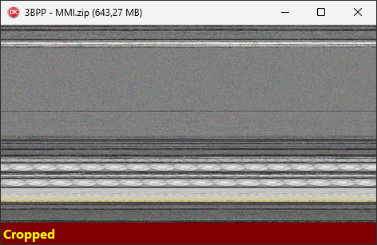

# Screenshots Gallery 📸

A collection of visual examples demonstrating how the **Binary-Visualizer** reveals underlying data structures and patterns across various file types, using different Bytes Per Pixel (BPP) settings.

---

### 3-Bytes-per-pixel viewing of a large store-compression-level .zip file:

---
### Viewing an .exe file (2-Bytes-per-pixel):
.")

---
### Viewing a text-based log file (3-Bytes-per-pixel):
.")

---
### Viewing a database file (3-Bytes-per-pixel):
.")

---
### Viewing Task Manager .exe file (1-Byte-per-pixel):
.")

---
### Viewing an uncompressed bitmap file (3-Bytes-per-pixel):
.")

---
### Viewing a compressed image file (3-Bytes-per-pixel):
.")

---
### Viewing a compressed file (1-Byte-per-pixel):
.")

---
### Viewing a binary file which has a pattern (1-Byte-per-pixel):
.")

---
